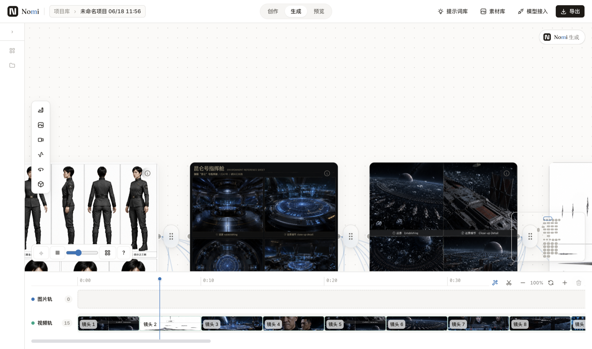

# Nomi Bilingual Growth Destination Implementation Plan

> **For agentic workers:** REQUIRED SUB-SKILL: Use superpowers:subagent-driven-development (recommended) or superpowers:executing-plans to implement this plan task-by-task. Steps use checkbox (`- [ ]`) syntax for tracking.

**Goal:** Build a production-ready bilingual Nomi homepage, English-first repository README, Chinese README, and public-safe business inquiry path that turn international promotion traffic into downloads or qualified project conversations.

**Architecture:** A dependency-free Node generator reads one locale-parity-checked content model and produces `/marketing/index.html` plus `/marketing/en/index.html`. Static tests protect locale metadata, licensing, asset links, and fallbacks; Playwright verifies the two real pages at desktop/mobile sizes and under reduced-motion, no-JavaScript, and failed-media conditions.

**Tech Stack:** Node.js ESM, static HTML/CSS/vanilla JavaScript, Cloudflare Static Assets, Playwright, FFmpeg/FFprobe, GitHub Issue Forms, Markdown.

---

## Scope and file map

The website, README pair, and business form stay in one plan because they are one conversion journey: understand Nomi, choose open-source download or a paid collaboration, then reach a working destination. External social posting is excluded; it starts only after this destination passes production QA.

| Responsibility | Files |
|---|---|
| Approved sample | Create `docs/plan/mockups/2026-08-01-nomi-bilingual-homepage.html` |
| Generator source | Create `scripts/marketing/{content,metadata,styles,client,template,social-card}.mjs`, `scripts/build-marketing-site.mjs`, `scripts/render-marketing-social-previews.mjs` |
| Generated pages | Replace `marketing/index.html`; create `marketing/en/index.html` |
| Automated evidence | Create `tests/ux/marketing-home.static.mjs` and `tests/ux/marketing-home.visual.mjs` |
| Media | Create `marketing/assets/video/{hero-loop.mp4,launch-film-en.mp4,launch-film-zh.vtt,launch-film-en.vtt,hero-poster.jpg}`, `marketing/assets/screen-agentic.jpg`, and two localized social-preview JPEGs; replace `marketing/assets/demo.mp4` |
| Repository entry | Replace `README.md`; create `README.zh-CN.md` and `.github/ISSUE_TEMPLATE/{business_inquiry.yml,config.yml}` |
| Routing/gates | Modify `marketing/{sitemap.xml,_headers}`, `package.json`, `.github/workflows/quality-gate.yml` |
| Baseline blocker | Modify `src/workbench/timeline/TimelineMiniPreview.tsx:78` |
| Superseded files | Delete `marketing/assets/demo.gif` and `marketing/assets/vendor/{ScrollTrigger.min.js,gsap.min.js}` after references move |

Generated outputs are committed, but source-of-truth edits happen only under `scripts/marketing/`. Never hand-edit `marketing/index.html` or `marketing/en/index.html` after the generator exists.

### Task 0: Restore a clean push-gate baseline

**Files:**

- Modify: `src/workbench/timeline/TimelineMiniPreview.tsx:78`
- Verify: `scripts/check-dangling-tokens.mjs`

- [x] **Step 1: Reproduce the exact baseline failure**

Run:

```bash
pnpm run check:dangling-tokens
```

Expected before the fix: FAIL listing only `--nomi-radius-md` at `TimelineMiniPreview.tsx:78`. If latest `origin/main` already changed the line to `--nomi-radius`, expect PASS and mark Steps 2 and 4 as already satisfied without creating a redundant commit.

- [x] **Step 2: Replace the invented medium token with the existing default-radius token**

Change the class fragment exactly to:

```tsx
'rounded-[var(--nomi-radius)] border border-[var(--workbench-border)]',
```

Do not add `--nomi-radius-md`: the design system already exposes `--nomi-radius-sm`, `--nomi-radius`, and `--nomi-radius-lg`; the bug is a caller naming drift, not a missing design-system tier.

- [x] **Step 3: Verify the structural guard**

Run:

```bash
pnpm run check:dangling-tokens
```

Expected: PASS with no undefined CSS variables.

- [x] **Step 4: Commit the isolated baseline repair**

```bash
git add src/workbench/timeline/TimelineMiniPreview.tsx
git commit -m "fix(timeline): use defined radius token in mini preview"
```

Expected: one-line commit, no website files included.

### Task 1: Produce and approve the visual HTML sample

**Files:**

- Create: `docs/plan/mockups/2026-08-01-nomi-bilingual-homepage.html`
- Read: `docs/design/nomi-design-system.md`
- Read: `docs/superpowers/specs/2026-08-01-nomi-bilingual-growth-destination-design.md`

- [x] **Step 1: Author one self-contained two-locale mockup**

The file must open without a build step and switch locale through `?lang=en` / `?lang=zh-CN`. Use this exact structural outline; populate the sections with the verbatim copy in design-spec Sections 3.2–3.5 and real images from `marketing/assets/`:

```html
<body data-locale="zh-CN">
  <header class="site-nav">Nomi · Product · For Teams · Docs · GitHub · 中文/EN · Download</header>
  <main>
    <section class="hero hero--monitor" id="top">
      <p class="eyebrow">LOCAL-FIRST · OPEN SOURCE · AI VIDEO WORKBENCH</p>
      <h1>把镜头讲清楚，<em>不让模型猜。</em></h1>
      <p class="hero-copy">故事、分镜、视觉锚点、生成画布与时间线，保持在同一个上下文里。</p>
      <div class="hero-actions">Download Nomi · 看 60 秒宣传片</div>
      <figure class="hero-proof"></figure>
    </section>
    <section id="product" class="proof-sequence">四个真实产品证据章节</section>
    <section id="teams" class="paths">Open Source for Creators · For Teams</section>
    <section class="closing">Bring your shot into focus · Download · GitHub</section>
  </main>
  <footer>AGPL-3.0-only · historical releases note · 中文/EN</footer>
</body>
```

CSS variables must start with:

```css
:root {
  --paper: #f2efe8;
  --paper-2: #ebe7dd;
  --ink: #1a1816;
  --ink-2: #3d3935;
  --muted: #8a8278;
  --rule: #d9d3c5;
  --coral: #e8765a;
  --coral-deep: #c7563d;
  --display: "Instrument Serif", "Noto Serif SC", serif;
  --body: "Inter", "Noto Sans SC", sans-serif;
  --mono: "JetBrains Mono", ui-monospace, monospace;
}
```

The visual job is “director contact sheet”: deep monitor Hero, warm editorial proof chapters, coral director marks, timecodes, and asymmetric image/text rhythm. Do not introduce gradient blobs, glass cards, neon, centered feature-card grids, or fabricated UI.

- [x] **Step 2: Serve and capture the sample at the two target sizes**

Run:

```bash
python3 -m http.server 4179 --directory /Users/aoqimin/Desktop/Nomi-bilingual-growth-spec
```

Open and screenshot:

```text
http://127.0.0.1:4179/docs/plan/mockups/2026-08-01-nomi-bilingual-homepage.html?lang=zh-CN
http://127.0.0.1:4179/docs/plan/mockups/2026-08-01-nomi-bilingual-homepage.html?lang=en
```

Capture full-page screenshots at 1440×900 and 390×844 into the ignored `tests/ux/_marketing/` directory.

- [x] **Step 3: Inspect all four screenshots pixel-by-pixel**

Acceptance:

- Hero claim and both actions are visible without scrolling at 1440×900.
- Mobile keeps logo, locale switch, and Download visible without a drawer.
- Real product evidence stays 16:9 and no key UI is cropped.
- English service labels do not wrap into orphan words.
- Open Source is visually primary; For Teams is equally discoverable but not louder.
- No horizontal overflow at 390 px or 320 px.

- [x] **Step 4: Stop for the required user visual approval**

Show both desktop and mobile screenshots. Do not begin Task 2 until the user explicitly approves the sample or requests a revision.

- [x] **Step 5: Commit the approved sample**

```bash
git add docs/plan/mockups/2026-08-01-nomi-bilingual-homepage.html
git commit -m "docs(marketing): approve bilingual homepage sample"
```

### Task 2: Lock the bilingual generator contract with failing tests

**Files:**

- Create: `tests/ux/marketing-home.static.mjs`
- Modify: `package.json:24,65`

- [x] **Step 1: Write the generated-page contract test before the generator**

Create `tests/ux/marketing-home.static.mjs` with these complete assertions:

```js
import fs from 'node:fs'
import path from 'node:path'
import { fileURLToPath } from 'node:url'

const root = path.resolve(path.dirname(fileURLToPath(import.meta.url)), '../..')
const read = (rel) => fs.readFileSync(path.join(root, rel), 'utf8')
const expect = (value, message) => {
  if (!value) throw new Error(`MARKETING HOME FAIL: ${message}`)
}

const zh = read('marketing/index.html')
const en = read('marketing/en/index.html')
const files = [
  'marketing/assets/video/hero-loop.mp4',
  'marketing/assets/demo.mp4',
  'marketing/assets/video/launch-film-en.mp4',
  'marketing/assets/video/launch-film-zh.vtt',
  'marketing/assets/video/launch-film-en.vtt',
  'marketing/assets/video/hero-poster.jpg',
  'marketing/assets/social-preview-zh.jpg',
  'marketing/assets/social-preview-en.jpg',
  '.github/ISSUE_TEMPLATE/business_inquiry.yml',
  'README.zh-CN.md',
]

expect(/<html lang="zh-CN">/.test(zh), 'Chinese lang is static')
expect(/<html lang="en">/.test(en), 'English lang is static')
expect(zh.includes('把镜头讲清楚'), 'Chinese Hero claim exists')
expect(en.includes('Direct the shot. Not just the prompt.'), 'English Hero claim exists')
expect(zh.includes('定制开发') && en.includes('Custom builds'), 'paid services are localized')
expect(zh.includes('Nomi MCP') && zh.includes('可编辑初稿'), 'Chinese agentic workflow is explicit')
expect(en.includes('One sentence to an editable first cut') && en.includes('Nomi over MCP'), 'English agentic workflow is explicit')
expect(zh.includes('/assets/nomi-logo.svg') && en.includes('/assets/nomi-logo.svg'), 'official Nomi mark is used')
expect(zh.includes('/en/') && en.includes('href="/"'), 'locale switch is a real link')
expect(zh.includes('rel="canonical" href="https://nomiaqm.com/"'), 'Chinese canonical')
expect(en.includes('rel="canonical" href="https://nomiaqm.com/en/"'), 'English canonical')
for (const html of [zh, en]) {
  expect((html.match(/hreflang=/g) || []).length === 3, 'three hreflang links')
  expect(html.includes('https://www.gnu.org/licenses/agpl-3.0.html'), 'AGPL JSON-LD URL')
  expect(!html.includes('https://www.apache.org/licenses/LICENSE-2.0'), 'no current Apache JSON-LD')
  expect(html.includes('autoplay') && html.includes('muted') && html.includes('playsinline'), 'silent hero attributes')
  expect(html.includes('<dialog') && html.includes('<track kind="captions"'), 'film dialog and captions')
  expect(html.includes('business_inquiry.yml'), 'business CTA destination')
}
for (const rel of files) expect(fs.existsSync(path.join(root, rel)), `${rel} exists`)
expect(!fs.existsSync(path.join(root, 'marketing/assets/demo.gif')), 'legacy demo GIF removed')
expect(!fs.existsSync(path.join(root, 'marketing/assets/vendor/gsap.min.js')), 'GSAP removed')
expect(!fs.existsSync(path.join(root, 'marketing/assets/vendor/ScrollTrigger.min.js')), 'ScrollTrigger removed')
console.log('MARKETING HOME STATIC PASS')
```

- [x] **Step 2: Add scripts that expose the missing generator contract**

Set the relevant `package.json` scripts exactly to:

```json
{
  "build:site": "node scripts/build-marketing-site.mjs && node scripts/build-marketing-site.mjs --check",
  "check:site": "node scripts/build-marketing-site.mjs --check && node tests/ux/marketing-home.static.mjs",
  "test:site": "pnpm run check:site && node tests/ux/marketing-quickstart.static.mjs",
  "test:site:visual": "pnpm run build:site && node tests/ux/marketing-home.visual.mjs"
}
```

- [x] **Step 3: Run the test to prove the feature does not exist**

Run:

```bash
node tests/ux/marketing-home.static.mjs
```

Expected: FAIL because `marketing/en/index.html` does not exist.

- [x] **Step 4: Commit only the red contract**

```bash
git add tests/ux/marketing-home.static.mjs package.json
git commit -m "test(marketing): define bilingual homepage contract"
```

---

### Task 3: Implement locale parity, metadata, and deterministic output

**Files:**

- Create: `scripts/marketing/content.mjs`
- Create: `scripts/marketing/metadata.mjs`
- Create: `scripts/marketing/styles.mjs`
- Create: `scripts/marketing/client.mjs`
- Create: `scripts/marketing/template.mjs`
- Create: `scripts/build-marketing-site.mjs`
- Generate: `marketing/index.html`
- Generate: `marketing/en/index.html`

- [x] **Step 1: Define one shared-facts object and two complete locales**

`content.mjs` must export this public contract:

```js
export const locales = ['zh-CN', 'en']
export const shared = Object.freeze({
  siteUrl: 'https://nomiaqm.com',
  repositoryUrl: 'https://github.com/aqm857886159/Nomi',
  releaseUrl: 'https://github.com/aqm857886159/Nomi/releases/latest',
  businessUrl: 'https://github.com/aqm857886159/Nomi/issues/new?template=business_inquiry.yml',
  licenseName: 'AGPL-3.0-only',
  licenseUrl: 'https://www.gnu.org/licenses/agpl-3.0.html',
})
export const contentByLocale = Object.freeze({ 'zh-CN': zhCN, en: english })
```

Define `zhCN` and `english` immediately above the export as literal objects. Both must contain exactly these top-level keys: `path`, `htmlLang`, `ogLocale`, `meta`, `nav`, `hero`, `proofs`, `paths`, `closing`, `footer`, `a11y`. Copy all visible text verbatim from design-spec Sections 3 and 7; `proofs` has IDs `context`, `world`, `canvas`, `agentic`, and `paths.teams.services` has IDs `custom`, `integration`, `whiteLabel`, `iteration`. The `agentic` proof must say that Claude Code or another AI assistant uses Nomi MCP plus Skills to advance an editable first cut; it must also state that the creator keeps final control.

Export an `assertLocaleParity()` function that recursively compares object keys and array lengths between `zh-CN` and `en`, rejects empty strings, requires the four proof IDs `context`, `world`, `canvas`, `agentic`, and throws a path-specific error such as `Locale parity error at paths.teams.services[3].title`.

- [x] **Step 2: Generate locale-specific metadata from shared facts**

`metadata.mjs` exports `buildMetadata(locale, content, shared)`. Its return shape is:

```js
{
  title,
  description,
  canonical,
  alternates: [
    { lang: 'zh-CN', href: 'https://nomiaqm.com/' },
    { lang: 'en', href: 'https://nomiaqm.com/en/' },
    { lang: 'x-default', href: 'https://nomiaqm.com/' },
  ],
  openGraph: { locale, title, description, image, imageAlt },
  jsonLd: {
    '@context': 'https://schema.org',
    '@type': 'SoftwareApplication',
    name: 'Nomi',
    applicationCategory: 'MultimediaApplication',
    operatingSystem: 'macOS, Windows',
    codeRepository: shared.repositoryUrl,
    license: shared.licenseUrl,
    url: canonical,
    softwareVersion: shared.version,
    downloadUrl: shared.releaseUrl,
    inLanguage: content.htmlLang,
  },
}
```

Chinese uses `/assets/social-preview-zh.jpg`; English uses `/assets/social-preview-en.jpg`.

- [x] **Step 3: Split visual, behavior, and semantic rendering**

`styles.mjs` exports `homepageCss`; copy the approved mockup’s exact CSS and add production rules for `dialog`, visible focus, `.js-only`, `.no-js-fallback`, `prefers-reduced-motion`, 390 px, and 320 px.

`client.mjs` exports `homepageClientJs`; it must:

```js
(() => {
  const localeKey = 'nomi_locale'
  const pageLocale = document.documentElement.lang
  const preferred = (() => { try { return localStorage.getItem(localeKey) } catch { return null } })()
  const browserLanguages = navigator.languages || [navigator.language || '']
  const wantsEnglish = browserLanguages[0]?.toLowerCase().startsWith('en') && !browserLanguages.some((v) => v.toLowerCase().startsWith('zh'))
  if (location.pathname === '/' && !preferred && wantsEnglish) location.replace('/en/')
  document.querySelectorAll('[data-locale-choice]').forEach((link) => link.addEventListener('click', () => {
    try { localStorage.setItem(localeKey, link.dataset.localeChoice) } catch {}
  }))
  const dialog = document.querySelector('#launch-film')
  const trigger = document.querySelector('[data-open-film]')
  const close = document.querySelector('[data-close-film]')
  if (dialog && trigger && typeof dialog.showModal === 'function') {
    trigger.addEventListener('click', (event) => { event.preventDefault(); dialog.showModal() })
    close?.addEventListener('click', () => dialog.close())
    dialog.addEventListener('click', (event) => { if (event.target === dialog) dialog.close() })
  }
  if (matchMedia('(prefers-reduced-motion: reduce)').matches) document.querySelector('[data-hero-video]')?.pause()
  document.documentElement.dataset.enhanced = 'true'
})()
```

`template.mjs` exports `renderHomepage(locale, runtimeFacts)`. Split the body into `renderNav`, `renderHero`, `renderProofs`, `renderPaths`, `renderClosing`, `renderFilmDialog`, and `renderFooter`; each receives only the content it renders. Escape text and attributes with dedicated functions. Inline the CSS and client string so no runtime script dependency can blank the page.

- [x] **Step 4: Implement atomic write/check behavior**

`build-marketing-site.mjs` must read `package.json`, create `runtimeFacts = Object.freeze({ ...shared, version: packageJson.version })`, call `assertLocaleParity()`, and render both pages with `runtimeFacts` before touching disk. In normal mode, create `marketing/en/` and write both files. In `--check`, compare bytes and exit non-zero with the exact stale paths; do not rewrite them.

- [x] **Step 5: Generate and inspect both outputs**

Run:

```bash
pnpm run build:site
```

Expected: `marketing/index.html` and `marketing/en/index.html` are generated; the immediate `--check` passes.

- [x] **Step 6: Commit the generator and generated pages**

```bash
git add scripts/marketing scripts/build-marketing-site.mjs marketing/index.html marketing/en/index.html
git commit -m "feat(marketing): generate bilingual static homepage"
```

---

### Task 4: Replace legacy demo media with verified web assets

**Files:**

- Create: `marketing/assets/video/hero-loop.mp4`
- Modify: `marketing/assets/demo.mp4`
- Create: `marketing/assets/video/launch-film-en.mp4`
- Create: `marketing/assets/video/launch-film-zh.vtt`
- Create: `marketing/assets/video/launch-film-en.vtt`
- Create: `marketing/assets/video/hero-poster.jpg`
- Create: `marketing/assets/screen-agentic.jpg`
- Create: `scripts/marketing/social-card.mjs`
- Create: `scripts/render-marketing-social-previews.mjs`
- Create: `marketing/assets/social-preview-zh.jpg`
- Create: `marketing/assets/social-preview-en.jpg`
- Delete: `marketing/assets/demo.gif`
- Delete: `marketing/assets/vendor/gsap.min.js`
- Delete: `marketing/assets/vendor/ScrollTrigger.min.js`

- [x] **Step 1: Produce the three web video files from the already-QA’d masters**

Run exactly:

```bash
mkdir -p marketing/assets/video
ffmpeg -y -i /Users/aoqimin/Downloads/Nomi-Web-Hero-Silent-15s.mp4 -c:v libx264 -preset slow -crf 24 -movflags +faststart -an marketing/assets/video/hero-loop.mp4
ffmpeg -y -i /Users/aoqimin/Downloads/Nomi-Launch-Film-CN-Master-v2.mp4 -vf "scale=1280:-2:flags=lanczos" -c:v libx264 -preset slow -crf 24 -c:a aac -b:a 160k -movflags +faststart marketing/assets/demo.mp4
ffmpeg -y -i /Users/aoqimin/Downloads/Nomi-Launch-Film-EN-Master-v1.mp4 -vf "scale=1280:-2:flags=lanczos" -c:v libx264 -preset slow -crf 24 -c:a aac -b:a 160k -movflags +faststart marketing/assets/video/launch-film-en.mp4
```

- [x] **Step 2: Convert captions and extract the hero fallback**

```bash
ffmpeg -y -i /Users/aoqimin/Downloads/Nomi-Launch-Film-CN.srt marketing/assets/video/launch-film-zh.vtt
ffmpeg -y -i /Users/aoqimin/Downloads/Nomi-Launch-Film-EN.srt marketing/assets/video/launch-film-en.vtt
ffmpeg -y -ss 00:00:02 -i marketing/assets/video/hero-loop.mp4 -frames:v 1 -q:v 2 marketing/assets/video/hero-poster.jpg
```

- [x] **Step 3: Probe hard media constraints**

Run:

```bash
ffprobe -v error -show_entries stream=codec_name,width,height,channels:format=duration,size -of json marketing/assets/video/hero-loop.mp4 marketing/assets/demo.mp4 marketing/assets/video/launch-film-en.mp4
```

If this FFprobe build accepts one input at a time, run the same command separately for each file. Acceptance: Hero is about 15.08 s, has no audio stream, and is ≤6 MB; both trailers are 1280×720, about 60.096 s, H.264/AAC, and ≤12 MB each. If a trailer exceeds 12 MB, rerun only that trailer at `-crf 26`, then probe again.

- [x] **Step 4: Generate deterministic bilingual social cards**

Before the social cards, extract the real MCP connection proof from the user-provided FocuSee recording. Use the source recording around `00:09:20`, crop only to a 16:9 frame without hiding the Claude Code / Codex / Cursor controls, resize to 1600 px wide, and save it as `marketing/assets/screen-agentic.jpg`. Do not use a generated UI or a launch-film frame with burned-in subtitle text.

`social-card.mjs` exports `renderSocialCard(locale)` and returns a 1200×630 self-contained HTML document using the official `marketing/assets/nomi-logo.svg`, warm-paper/dark-monitor split, coral director frame, locale claim, and `LOCAL-FIRST · OPEN SOURCE · AI VIDEO WORKBENCH`. `render-marketing-social-previews.mjs` opens each returned document in Playwright at 1200×630 and saves JPEG quality 92 to the two target paths.

Run:

```bash
node scripts/render-marketing-social-previews.mjs
```

Expected: two 1200×630 JPEGs. Inspect both images; reject text clipping, low-contrast coral, fake UI, or unreadable small copy.

- [x] **Step 5: Delete superseded media and animation runtime**

Delete only these exact tracked files after confirming the generated homepage has no references:

```text
marketing/assets/demo.gif
marketing/assets/vendor/gsap.min.js
marketing/assets/vendor/ScrollTrigger.min.js
```

- [x] **Step 6: Rebuild and verify the media migration directly**

```bash
pnpm run build:site
node -e "const fs=require('fs'); for (const f of ['marketing/assets/video/hero-loop.mp4','marketing/assets/demo.mp4','marketing/assets/video/launch-film-en.mp4','marketing/assets/video/launch-film-zh.vtt','marketing/assets/video/launch-film-en.vtt','marketing/assets/video/hero-poster.jpg','marketing/assets/social-preview-zh.jpg','marketing/assets/social-preview-en.jpg']) if (!fs.existsSync(f)) throw new Error(f); for (const f of ['marketing/assets/demo.gif','marketing/assets/vendor/gsap.min.js','marketing/assets/vendor/ScrollTrigger.min.js']) if (fs.existsSync(f)) throw new Error('superseded '+f);"
```

Expected: exit 0; all new assets exist and all superseded files are absent. The full static contract remains intentionally red until Task 5 creates the README pair and Issue Form.

- [x] **Step 7: Commit media migration**

```bash
git add marketing/assets scripts/marketing/social-card.mjs scripts/render-marketing-social-previews.mjs marketing/index.html marketing/en/index.html
git commit -m "feat(marketing): ship verified bilingual launch media"
```

---

### Task 5: Rewrite the repository entry and add the business path

**Files:**

- Modify: `README.md`
- Create: `README.zh-CN.md`
- Create: `.github/ISSUE_TEMPLATE/business_inquiry.yml`
- Create: `.github/ISSUE_TEMPLATE/config.yml`

- [x] **Step 1: Replace the root README with the approved English-first sequence**

Use these exact first-screen claims and destinations:

```markdown
# Nomi

**Direct the shot. Not just the prompt.**

Nomi is an open-source, local-first AI video workbench that keeps your story, storyboard, visual anchors, generation canvas, and timeline connected.

[简体中文](README.zh-CN.md) · [Website](https://nomiaqm.com/en/) · [Download](https://github.com/aqm857886159/Nomi/releases/latest) · [Watch the 60s film](https://nomiaqm.com/assets/video/launch-film-en.mp4) · [For Teams](https://nomiaqm.com/en/#teams)
```

Then include: badges; the inspected poster linked to the film; `Why Nomi` with Connected context / Visual anchors / Directable workflow / Agentic creation over MCP; the three-platform download table; `Quick start`; `For Teams`; `Developers`; `Contributing`; `License`. The agentic entry must explain that Claude Code, Codex, or Cursor can invoke Nomi through MCP and use Skills to advance an editable first cut while the creator retains final control. The For Teams paragraph must name Custom builds, Integrations, White-label/commercial license, and Ongoing iteration, then link to the Business Issue Form.

The English License section must say: `Current releases are licensed under AGPL-3.0-only. Historical releases published under Apache-2.0 keep their original license.`

- [x] **Step 2: Create the concise Chinese README**

Start with:

```markdown
# Nomi

**把镜头讲清楚，不让模型猜。**

Nomi 是本地优先、开源的 AI 视频导演工作台：把故事、分镜、视觉锚点、生成画布和时间线保持在同一个上下文里。

[English](README.md) · [官网](https://nomiaqm.com/) · [下载](https://github.com/aqm857886159/Nomi/releases/latest) · [看 60 秒宣传片](https://nomiaqm.com/assets/demo.mp4) · [团队服务](https://nomiaqm.com/#teams)
```

Retain the current Chinese domestic download mirror, first-open warning, Quick start, user group/WeChat, development commands, CLA, AGPL current-license rule, and historical Apache wording. Remove the long model/provider feature wall and expiring “8 月 4 日前有效” group-QR claim.

- [x] **Step 3: Add the public-safe GitHub Issue Form**

Create `.github/ISSUE_TEMPLATE/business_inquiry.yml` exactly as:

```yaml
name: Business inquiry
description: Discuss a custom build, integration, white-label license, or ongoing iteration engagement.
title: "[Business] "
body:
  - type: markdown
    attributes:
      value: |
        This issue is public. Do not include secrets, credentials, private contact details, budget details, or NDA-protected information. Share only a non-confidential summary; the maintainer will reply with the next private-contact step.
  - type: dropdown
    id: collaboration
    attributes:
      label: Collaboration type
      options:
        - Custom build
        - Integration
        - White-label / commercial license
        - Ongoing iteration
    validations:
      required: true
  - type: input
    id: organization
    attributes:
      label: Organization or project
      description: Use “Undisclosed” if the public name cannot be shared.
    validations:
      required: true
  - type: textarea
    id: summary
    attributes:
      label: Non-confidential summary
      description: Describe the workflow problem and the outcome you need without private implementation details.
    validations:
      required: true
  - type: dropdown
    id: platform
    attributes:
      label: Target platform
      multiple: true
      options:
        - Desktop
        - Private deployment
        - Existing product integration
        - Other
    validations:
      required: true
  - type: dropdown
    id: timing
    attributes:
      label: Timing
      options:
        - Exploring
        - Within 3 months
        - Within 6 months
        - No fixed date
    validations:
      required: true
  - type: checkboxes
    id: public_confirmation
    attributes:
      label: Public-information confirmation
      options:
        - label: I confirm this issue contains no secrets, credentials, private contact details, budget details, or NDA-protected information.
          required: true
```

Create `.github/ISSUE_TEMPLATE/config.yml` exactly as:

```yaml
blank_issues_enabled: false
contact_links:
  - name: Questions and discussion
    url: https://github.com/aqm857886159/Nomi/discussions
    about: Ask usage questions or share ideas in Discussions.
  - name: Private security report
    url: https://github.com/aqm857886159/Nomi/security/advisories/new
    about: Do not disclose vulnerabilities in a public issue.
```

- [x] **Step 4: Run the now-complete static contract**

```bash
pnpm run build:site
node tests/ux/marketing-home.static.mjs
```

Expected: `MARKETING HOME STATIC PASS`.

- [x] **Step 5: Commit README and inquiry path**

```bash
git add README.md README.zh-CN.md .github/ISSUE_TEMPLATE marketing/index.html marketing/en/index.html
git commit -m "docs: add bilingual product and business entry"
```

---

### Task 6: Protect SEO, generated drift, and CI

**Files:**

- Modify: `marketing/sitemap.xml`
- Modify: `marketing/_headers`
- Modify: `package.json`
- Modify: `.github/workflows/quality-gate.yml`
- Modify: `tests/ux/marketing-home.static.mjs`

- [x] **Step 1: Add exact route metadata assertions**

Extend the static test with:

```js
const sitemap = read('marketing/sitemap.xml')
expect(sitemap.includes('<loc>https://nomiaqm.com/en/</loc>'), 'English route in sitemap')
expect((zh.match(/<meta property="og:locale"/g) || []).length === 1, 'one Chinese OG locale')
expect((en.match(/<meta property="og:locale"/g) || []).length === 1, 'one English OG locale')
expect(zh.includes('social-preview-zh.jpg'), 'Chinese social card')
expect(en.includes('social-preview-en.jpg'), 'English social card')
expect(read('README.md').includes('historical releases'), 'English historical-license context')
expect(read('README.zh-CN.md').includes('历史版本'), 'Chinese historical-license context')
```

- [x] **Step 2: Run the new assertion red**

```bash
node tests/ux/marketing-home.static.mjs
```

Expected: FAIL because `/en/` is not yet in the sitemap.

- [x] **Step 3: Update sitemap and HTML cache headers**

Add `/en/` with lastmod `2026-08-01`, weekly changefreq, priority `1.0`; keep root, quickstart, and handbook. In `_headers`, add `/en/index.html` with `Cache-Control: public, max-age=0, must-revalidate`. Keep the general immutable asset rule, but override `/assets/demo.mp4`, `/assets/video/*`, `/assets/social-preview-zh.jpg`, and `/assets/social-preview-en.jpg` with `Cache-Control: public, max-age=3600, must-revalidate` because these public filenames are intentionally stable while their bytes can change.

- [x] **Step 4: Put the site contract into local and CI gates**

In `package.json`, insert `pnpm run check:site` after `pnpm run check:i18n` and before lint in the `gates` command. In `.github/workflows/quality-gate.yml`, add:

```yaml
      - name: Marketing site
        run: pnpm run check:site
```

Place it after File size guard and before Lint.

- [x] **Step 5: Run site build, drift check, and both site tests**

```bash
pnpm run build:site
pnpm run check:site
pnpm run test:site
```

Expected: bilingual contract and existing quickstart visual/static test both pass; `git diff --exit-code -- marketing/index.html marketing/en/index.html` is clean after generation.

- [x] **Step 6: Commit SEO and gate coverage**

```bash
git add marketing/sitemap.xml marketing/_headers package.json .github/workflows/quality-gate.yml tests/ux/marketing-home.static.mjs
git commit -m "test(marketing): gate bilingual SEO and generated output"
```

---

### Task 7: Build the real-browser journey and inspect user-visible output

**Files:**

- Create: `tests/ux/marketing-home.visual.mjs`
- Generate but do not commit: `tests/ux/_marketing/home-*.png`

- [x] **Step 1: Implement a static server that handles directory routes**

Copy the safe-path and MIME approach from `marketing-quickstart.static.mjs`. Route `/` to `index.html`, `/en/` to `en/index.html`, and reject any resolved path outside `marketingRoot`. Include MIME types for `.html`, `.svg`, `.png`, `.jpg`, `.mp4`, and `.vtt`.

- [x] **Step 2: Implement the browser audit matrix**

The script must launch Chromium and run these cases:

```js
const cases = [
  { name: 'zh-desktop', path: '/', locale: 'zh-CN', viewport: { width: 1440, height: 900 } },
  { name: 'en-desktop', path: '/en/', locale: 'en-US', viewport: { width: 1440, height: 900 } },
  { name: 'zh-mobile', path: '/', locale: 'zh-CN', viewport: { width: 390, height: 844 } },
  { name: 'en-mobile', path: '/en/', locale: 'en-US', viewport: { width: 390, height: 844 } },
]
```

For each case: wait for `networkidle`; assert horizontal overflow ≤1 px; assert one H1; assert `#product`, `#teams`, Download, GitHub, locale link, hero poster/video, and four proof sections; capture a full-page screenshot; open the film dialog and assert the locale-matching `<track>`; close with Escape.

- [x] **Step 3: Add the three failure-mode journeys**

1. `javaScriptEnabled: false`: open both direct locale routes; assert H1, Download, and direct Watch link remain usable.
2. `reducedMotion: 'reduce'`: assert hero video is paused and all sections have non-zero layout boxes.
3. Abort requests matching `/assets/video/` and `fonts.googleapis.com`: assert poster/alt text, H1, Download, and For Teams still render.

Add an English-preference case that opens `/` in a fresh `en-US` context and expects the final URL to end in `/en/`. Then click the Chinese locale link, revisit `/`, and expect the explicit `zh-CN` preference to prevent redirect.

- [x] **Step 4: Run the visual journey**

```bash
pnpm run test:site:visual
```

Expected: all assertions pass and screenshots are created under `tests/ux/_marketing/`.

- [x] **Step 5: Inspect every screenshot with human vision**

Open the four standard screenshots plus reduced-motion and blocked-media screenshots. Compare with the approved Task 1 sample. Check real pixels for: no crop, no black frame, no subtitle overflow, no orphan service word, CTA hierarchy, 320/390 px wrapping, visible focus, and no section stranded invisible.

If any screenshot differs materially from the approved sample, fix `styles.mjs` or `template.mjs`, regenerate, rerun the matrix, and inspect the new pixels. Do not declare completion from assertions alone.

- [x] **Step 6: Commit the durable journey, not the ignored screenshots**

```bash
git add tests/ux/marketing-home.visual.mjs scripts/marketing marketing/index.html marketing/en/index.html
git commit -m "test(marketing): verify bilingual homepage journeys"
```

---

### Task 8: Final verification, documentation, and safe main integration

**Files:**

- Modify: `docs/superpowers/specs/2026-08-01-nomi-bilingual-growth-destination-design.md`
- Modify: `docs/plan/2026-08-01-nomi-bilingual-growth-destination-implementation.md`

- [x] **Step 1: Mark evidence, not hopes**

Update the spec state to `implemented and verified`. Append a short evidence block containing the exact generated routes, screenshot directory, three local video paths, `pnpm run test:site` result, visual journey result, and final gate result. Check completed plan boxes only for actions actually performed.

- [x] **Step 2: Run the complete project gate**

```bash
pnpm run gates
```

Expected: filesize, tokens, dangling tokens, archetype defaults, secrets, i18n, site tests, lint, typecheck, all Vitest tests, and production build pass. Existing warning count must not exceed the repository ratchet.

- [x] **Step 3: Inspect the final diff for source/generated discipline**

```bash
git diff --check
git status --short
git diff --stat origin/main...HEAD
node scripts/build-marketing-site.mjs --check
```

Expected: no whitespace errors, no untracked deliverables, generated pages current, no unrelated user changes, and no deleted asset still referenced by tracked files.

- [x] **Step 4: Commit evidence**

```bash
git add docs/superpowers/specs/2026-08-01-nomi-bilingual-growth-destination-design.md docs/plan/2026-08-01-nomi-bilingual-growth-destination-implementation.md
git commit -m "docs(marketing): record bilingual launch verification"
```

- [x] **Step 5: Integrate onto latest remote main in a fresh sibling worktree**

From the primary repository, fetch `origin/main`, create a detached sibling worktree pinned to it, cherry-pick only this plan’s commits, install dependencies, and rerun `pnpm run gates`. Before push, fetch again and require `git merge-base --is-ancestor origin/main HEAD` to succeed.

- [x] **Step 6: Push only after the latest-main gate is green**

```bash
git push origin HEAD:main
```

Expected: fast-forward update of `origin/main`. Remove the temporary integration worktree only after confirming it is clean. Keep the approved mockup, generator source, generated pages, tests, and documentation; keep all screenshots in the ignored QA directory.

---

## Final acceptance checklist

- [x] `/` is static Chinese and `/en/` is static English.
- [x] Browser-language redirect runs once and an explicit locale choice wins thereafter.
- [x] Both routes have localized canonical, hreflang, OG, Twitter, and JSON-LD metadata.
- [x] Current-license positions say AGPL-3.0-only; Apache appears only in historical context.
- [x] Hero proof is silent, reduced-motion safe, and survives failed video/font loads.
- [x] Chinese and English 60-second films play with locale-matching WebVTT captions.
- [x] Four real product proofs are legible at 1440, 390, and 320 px.
- [x] Open Source is primary; Custom builds, Integrations, White-label, and Ongoing iteration are explicit.
- [x] Business inquiry warns that the issue is public and collects no private details or budget.
- [x] Root README is English-first and `README.zh-CN.md` preserves Chinese download/community needs.
- [x] Old demo GIF and GSAP files are gone and unreferenced.
- [x] Static tests, visual journeys, project gates, latest-main gates, and human screenshot comparison all pass.
