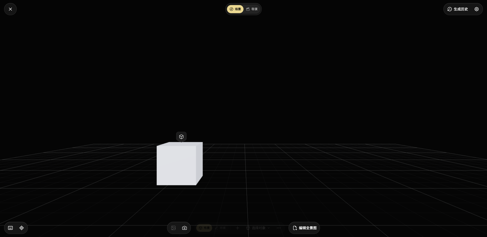
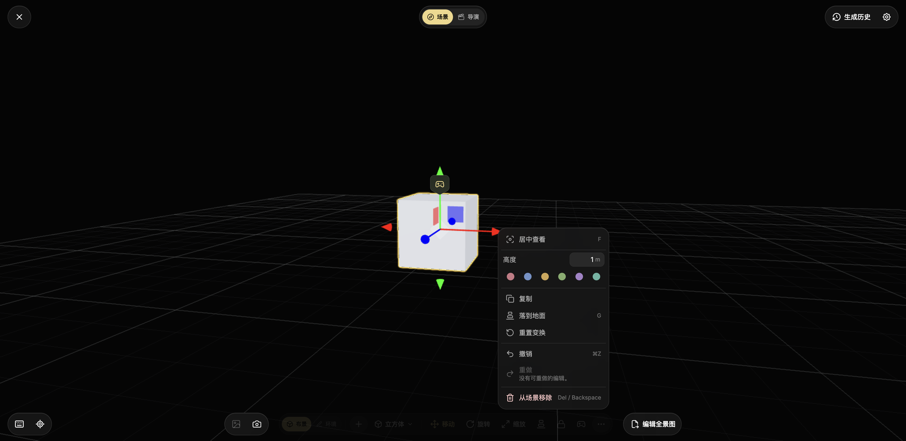
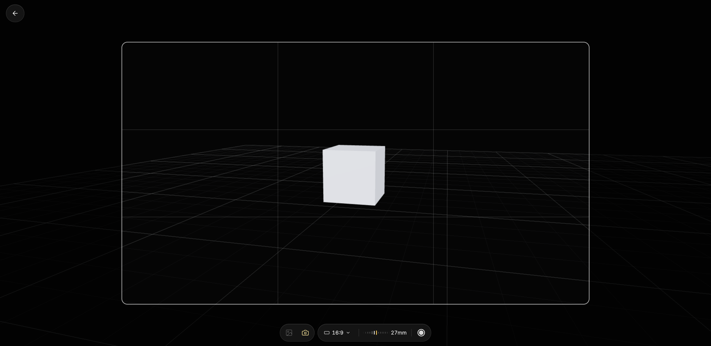
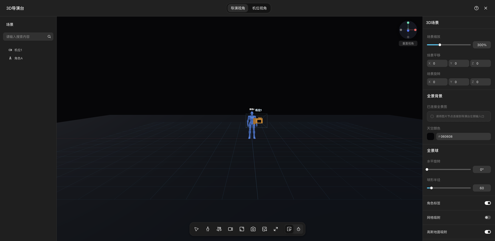
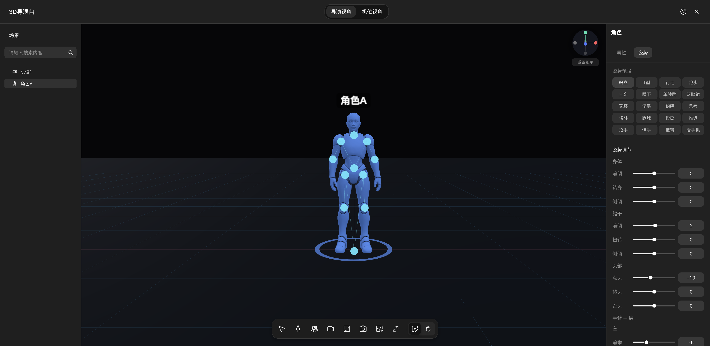
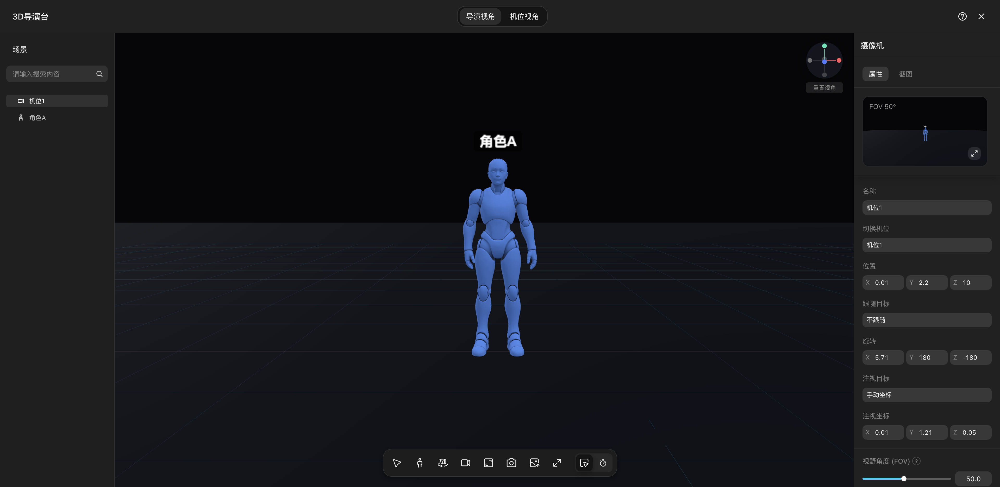
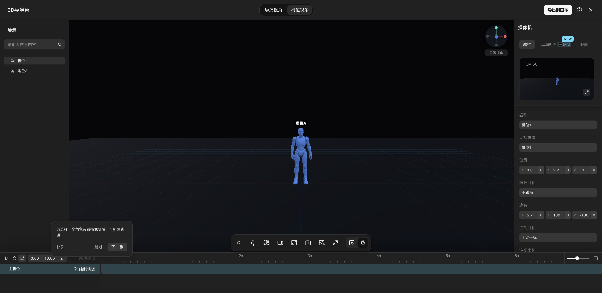
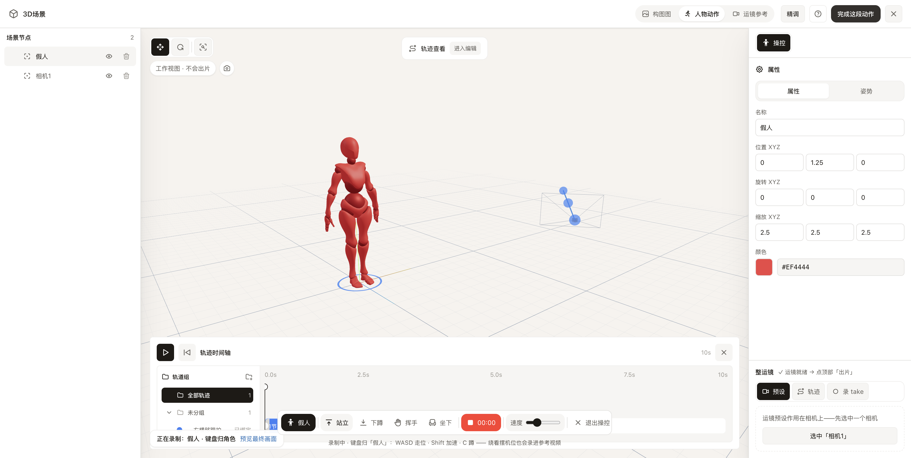
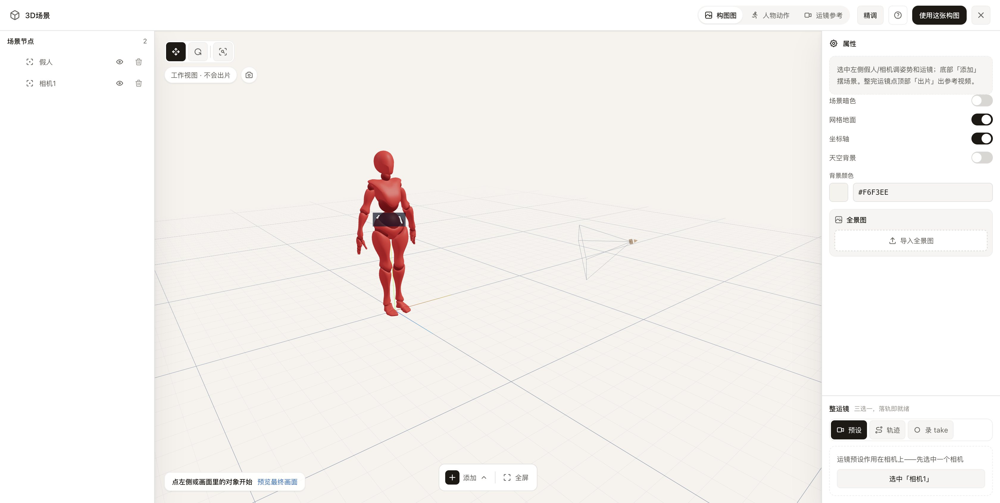
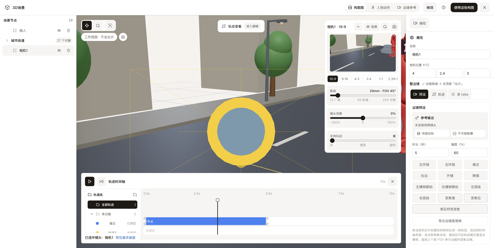

# 3D 导演台调研与优化设计

日期：2026-07-26
范围：开源项目、Nomi、TapNow、LibTV
结论状态：调研与方案完成，尚未进入 UI 样张或生产实现

## 先说结论

Nomi 不该继续长成一个“小 Blender”，也不该照抄 TapNow 的通用 3D 世界。

更准确的产品定位是：

> **镜头参考编译器**——用户给出人物关系、动作与镜头意图，Nomi 把它编译成模型不容易误读的空间状态，并直接交付一格可用分镜或一段可用运镜参考。

背后的真实摩擦不是“用户不会调更多 3D 参数”，而是：

- 他只想让两个人站对、看对、拍对，却要先理解场景树、坐标、骨骼、相机、焦段和时间轴；
- 画面调得差不多后，还不确定“哪一个视图才是最后会交给模型的画面”；
- 点了出片后，如果渲染失败，当前 Nomi 可能一直停在“渲染较慢”，用户不知道该等、该重试还是已经丢了；
- 同一个动作或机位在不同入口重复出现，用户先要判断“我该从哪条路做”，才开始创作。

因此优化重点不是再加功能，而是把已经存在的能力收束成一条确定路径：

1. **意图预设**：先选“对峙 / 并肩 / 越肩 / 双人中景 / 低机位”等画面语言；
2. **直接操作**：在视口里拖人物、相机和视线，立即看到结果；
3. **高级精调**：只有需要时才展开骨骼轴、坐标、Near/Far 等技术参数；
4. **最终镜头真相**：编辑过程中始终能看到真正要输出的画面；
5. **一键交付参考包**：画布默认只出现最终参考图；参考包内部记录源场景版本与机位，空间关系图、首尾帧、姿势/深度图或运镜视频只在下游确实需要时生成。

## 1. 证据与新鲜度

### 1.1 截图来源

| 产品 | 证据时间 | 入口与状态 | 说明 |
|---|---|---|---|
| TapNow | 2026-07-26 | 用户已登录的真实项目，进入 3D World，逐项打开场景、导演、物体、环境、取景器 | 本轮实时截图；未生成付费内容，未修改工程数据 |
| LibTV | 2026-07-26 | 用户已登录的真实画布，进入 3D 导演台，逐项打开角色姿势、相机、机位视角、动画时间轴 | 本轮实时截图；只切换视图/选中对象，未改参数与工程 |
| Nomi | 截图为 2026-07-22；源码与构建核对为 2026-07-26 | 官方独立 E2E 走查的当前主壳、任务条、运镜与录制状态 | 本轮 `pnpm build` 通过并逐文件审计；7 月 22 日后主壳未重构，只修了安全画幅、跟拍和结果卡持久化。为诚实起见，不把旧图标成“7 月 26 日刚截” |

完整原图目录：[`screenshots/`](./2026-07-26-3d-director-stage/screenshots/)

### 1.2 同一任务基准

所有产品按同一导演任务观察：

1. 放入人物或物体；
2. 建立站位、朝向和动作关系；
3. 选择机位、景别、焦段或画幅；
4. 从自由编辑视角检查空间，从最终机位检查成片；
5. 产出能继续送给图像/视频模型的参考。

这让“控件多不多”退到次要位置，真正比较的是：**用户走到可用结果前，要学多少、判断多少、返工多少。**

## 2. TapNow：把 3D 当作沉浸式创意画布

### 2.1 观察事实

TapNow 进入 3D World 后几乎完全占据屏幕，首层只保留：

- 顶部“场景 / 导演”任务切换；
- 底部随当前对象变化的上下文工具；
- 场景对象搜索、生成历史、布景与环境入口；
- 选中对象后才出现移动、旋转、缩放、落地、锁定、控制对象和动作；
- 独立取景器提供焦距、画幅和快门，退出取景器后回到空间编辑。



选中立方体后，底栏才出现与这个对象有关的动作，没有永久属性栏：



取景器把所有空间编辑控件暂时移走，只留下最终画面、焦距、画幅与拍摄：



### 2.2 为什么这样设计

这是一个面向广泛创意用户的“世界搭建器”，不是精确 previs 工具。它优先解决的是“我一进来就敢拖、敢试”，所以：

- 用全屏视口制造沉浸感；
- 用上下文工具避免用户先读完整面板；
- 把“场景搭建”和“导演时间状态”分成两个首层任务；
- 把最终取景做成专门模式，减少拍摄时的视觉干扰；
- 同时支持 AI 生成、历史复用、基础几何体和上传模型，让入口围绕“我要一个东西”，而不是“我要新建某种 3D 类型”。

### 2.3 值得借与不该借

值得借：

- **上下文工具**：没选对象时不展示对象参数，选中后才出现可行动作；
- **任务分层**：场景搭建与导演状态不是同一屏平铺；
- **专用最终画面**：焦距与画幅围绕输出画面，而不是散在通用 Inspector；
- **自然语言对象入口**：生成、复用、几何体、上传是同一个“添加对象”问题。

不该照抄：

- 最终取景器与空间编辑完全分离，精确调度时仍需来回切换；
- 场景对象层级与锁定关系藏得较深，多人物复杂镜头不够可审计；
- 低对比、全隐藏式控件提高了首次探索成本；
- 它的范围是“造一个 3D 世界”，而 Nomi 的任务是“让下一格分镜和下一段视频更可靠”。

## 3. LibTV：把 3D 当作轻量专业 previs

### 3.1 观察事实

LibTV 使用经典 DCC 工作区：

- 左侧固定场景树；
- 中央自由 3D 视口；
- 右侧对象 Inspector；
- 顶部“导演视角 / 机位视角”；
- 底部工具条与可展开动画时间轴。



角色姿势先给 20 个语义预设，下面继续平铺身体、躯干、头、肩、肘、髋、膝等轴向滑杆：



相机有自己的最终画面缩略图、位置、旋转、注视目标和 FOV：



动画时间轴打开后占据底部约四分之一高度，并新增轨道、新手教学和导出到画布：



### 3.2 为什么这样设计

LibTV 追求的是“专业能力可见、对象可管理、参数可精确回看”。所以它采用用户在 Blender、Unity、剪辑软件中熟悉的稳定分区：

- 场景树让复杂工程可审计；
- Inspector 让每个对象都有明确参数归属；
- 导演视角负责摆场，机位视角负责检查最终镜头；
- 预设先帮助新手，滑杆继续满足专业用户；
- 时间轴承担动作、相机和运动轨迹的统一时间表达。

它的设计逻辑自洽，但交换条件也很明确：**能力越全部可见，用户越像是在操作一个 3D 软件，而不是完成一个镜头。**

### 3.3 值得借与不该借

值得借：

- 左侧场景树提供稳定的对象、显隐和锁定真相；
- 姿势“语义预设在前，精调在后”的顺序是对的；
- 导演视角与最终机位视角明确区分；
- 相机可跟随/注视角色，使用导演语义而不是只暴露旋转轴；
- 动画时间轴按需展开，不永久占据首屏。

不该照抄：

- 20 个姿势按钮下面立刻跟着整页关节滑杆，仍把新手带回 DCC；
- 相机位置、旋转、注视坐标、FOV 同级平铺，用户要自己把参数翻译成画面；
- 时间轴一打开就引入轨道、关键点、教程和新模式，任务跨度过大；
- “专业能力全部有”会把 solo 产品拖进资产、动画、物理、时间轴的广度战。

## 4. Nomi 当前真相：闭环已经有了，入口没有完全收口

### 4.1 已经存在的完整能力

旧审计里“没有手动入口、AI 与手动两条路不通”的判断已经过时。当前 Nomi 已经具备：

- 画布直接创建 `scene3d` 节点并进入全屏导演台；
- 顶部“构图图 / 人物动作 / 运镜参考”三任务；
- 左侧场景树、中央自由视口、相机最终预览、右侧属性与整运镜；
- 13 个姿势预设、骨骼精调、场景模板、道具、群众、相机；
- 运镜预设、手绘轨迹、录 take；
- 截图、首尾帧、MP4 与下游 `composition_ref` / `video_ref`；
- AI 站位与 AI 运镜和人工编辑共用 `Scene3DState`、同一离屏捕获 Host 和同一持久化工程。

关键实现证据：

- 完整壳层：`src/workbench/generationCanvas/nodes/scene3d/Scene3DFullscreen.tsx:504`
- 三任务与 CTA：`src/workbench/generationCanvas/nodes/scene3d/Scene3DFullscreenHeader.tsx:48`
- 姿势与精调：`src/workbench/generationCanvas/nodes/scene3d/scene3dInspector.tsx:369`
- 运镜三入口：`src/workbench/generationCanvas/nodes/scene3d/scene3dMoveHub.tsx:70`
- 截图/首尾帧：`src/workbench/generationCanvas/nodes/useScene3DCaptureExport.ts:17`
- 运镜参考视频：`src/workbench/generationCanvas/nodes/cameraMoveReferenceNode.ts:43`
- AI 与人工共用状态：`src/workbench/generationCanvas/agent/applyCanvasToolCall.ts:342`
- 状态真相源：`src/workbench/generationCanvas/nodes/scene3d/scene3dSerializer.ts:377`

### 4.2 当前最重的体验摩擦与合同阻断

#### P0：异步出片没有统一失败终态

当前结果卡只有 `rendering / slow / done`。相机捕获最终放弃后只会清标志，站位捕获没有 watchdog；用户可能永远看到“渲染较慢”。

这不是提示文案问题，而是状态合同少了 `failed`：

- `useScene3DFullscreenActions.ts:564`
- `CameraMoveCaptureHost.tsx:185`
- `StagingCaptureHost.tsx:35`
- `Scene3DAutoCapture.tsx:48`

用户体验：**我做完了，但不知道 Nomi 还在做、已经失败，还是应该重试。**

更深一层，截图与首尾帧还有“乐观成功”：

- `useScene3DCaptureExport.ts:34` 的捕获回调没有返回可等待的落盘结果；
- `useScene3DCaptureExport.ts:107` 会在真实落盘完成前报告“2 张已导出”；
- 真正写文件仍可能在 `Scene3DEditor.tsx:251` 失败。

所以根修必须是一套统一的产物任务合同，而不是给“渲染较慢”再加一条提示。

#### P0：最终机位所有权仍是隐藏的

相机 Monitor 只在当前选中对象恰好是相机时出现；用户改选人物后，最终画面真相会消失：

- `Scene3DFullscreen.tsx:671`

离屏捕获又默认拿 `cameras[0]` 当最终机位：

- `Scene3DTrajectoryCapture.tsx:141`
- `Scene3DTrajectoryCapture.tsx:198`

录相机 take 时甚至通过重排数组把所选相机放到第 0 位：

- `takeRecording.ts:277`

数组顺序不应决定哪一镜出片。必须存在显式 `activeCoverageId / activeCameraId`；对象 selection 只表示“我正在编辑谁”，不能兼任“最终输出属于谁”。

#### P0：多段运镜的写入、序列化与播放合同互相冲突

预设代码允许同一对象连续追加多段：

- `cameraMovePreset.ts:252`

但 serializer 会过滤同一 `objectId` 的后续 binding：

- `scene3dSerializer.ts:421`

播放又用 `.find()` 永远取第一条：

- `scene3dPlayback.ts:60`

因此静态镜头可靠性必须先于运镜扩张；在解决 owner、segment 与 playhead 语义之前，不应把更多 timeline 能力带进主路径。

#### P0：录 take 长回两套心智

现在同时存在：

- 顶部“人物动作 → 开始录制”的 effect-first 路径；
- 右栏“整运镜 → 录 take → 操控对象”；
- 底部 REC；
- 右栏“操控”；
- 录制中顶部“完成这段动作”和底部红色停止计时。



用户体验：**开始前先判断入口，开始后再判断哪个“停止”才算完成。**

#### P1：默认右栏把低频环境能力铺进主路

未选中对象时，右栏首先展示场景暗色、网格、坐标轴、天空、背景色和全景图；已有提示卡甚至承认它们“不是下一步”。



环境不是坏功能，问题是它在用户还没完成“人站哪、镜头拍哪”之前占据了最贵的默认位置。

#### P1：相机画幅 / FOV 有两个家

相机预览卡和右侧 Inspector 同屏都可修改画幅与 FOV；Inspector 还把 `near / far` 与高频构图参数并列。



这违反 7 月 20 日已经拍板的“一个功能一个家”：画幅与焦段应归最终相机预览，Inspector 只留对象关系与高级参数。

#### P1：姿势预设与 35 项手调同层展开

13 个语义预设本来是面向创作者的主路，但 35 个骨骼参数没有进入高级层，预设与轴向精调在认知上被当成同等重要。

### 4.3 三个卫生问题

- 三处活文案仍指向已删除的顶部“出片”按钮；
- 输出视图 chip 与底部状态卡重复触发同一个切换；
- 轨迹右栏“进入视口编辑”和视口顶部 banner 重复。

这些都不需要产品决策，应随下一次收口同批删除旧入口。

### 4.4 为什么会变成这样

每一层能力单看都有理由：

- 初期先有属性 Inspector；
- 后来补了任务优先 CTA；
- 再加相机预览卡；
- 再加运镜三模式；
- 再加 effect-first 录制；
- 为了不挡首屏，把时间轴改成按需出现。

问题不是某个功能错误，而是**新主路出现后，旧主路没有同批退出**。这正是重复入口、双 home 与 800 行主壳继续生长的根因。

## 5. 开源项目：成熟产品机制比“开源 3D 编辑器”更有价值

截至 2026-07-26，没有一个开源项目同时做到“成熟、活跃、面向非 3D 用户、完整覆盖导演任务”。正确做法不是押一个技术基座，而是抽取已经被验证的产品机制。

| 项目 | 当前状态 | 最值得借的机制 | 不该复制 |
|---|---|---|---|
| [Wonder Unit Storyboarder](https://github.com/wonderunit/storyboarder) | 3,768★；默认分支 2022-06-30 后停滞 | 姿势缩略图优先；多机位编号切换；保存时同时产出最终画面、俯视图与可编辑状态 | 旧 Electron 架构、骨骼 Euler 滑杆、粗糙随机镜头 |
| [Blockout](https://github.com/wassermanproductions/blockout) | 2026-07 新项目，约 94★、57 次提交；仍是预发布 | `STAGE → SHOOT → DELIVER`；Scene 拥有 blocking、Shot 拥有 camera；输出物就是产品 | 环境/群众/车辆/39 运镜/时间轴/Blender/MCP 全包的范围 |
| [Kunpeng Director](https://github.com/pengfeiqiao/kunpeng-director) | 2026-07 原型，9★、5 次提交 | 人与 Agent 共用一份精确状态；人工锁定；自由视口旁持续显示最终 Monitor | 把原型当成熟架构；手写姿势高度偏移与固定 24fps |
| [Storytools](https://github.com/Pullusb/storytools) | 活跃 Blender 插件，2026-07-26 仍提交 | 把 transform 翻译成 Pan / Depth / Aim；深度操作时临时出现俯视小地图 | Blender 的模式、层、集合和关键帧心智 |
| [3D OpenPose Editor](https://github.com/nonnonstop/sd-webui-3d-open-pose-editor) | 804★，2023 后停滞 | 锁定最终输出视角后继续自由编辑；一次生成 Pose/Depth/Normal/Canny | 把 Orbit 观察相机当导演机位；缺少 shot 与角色身份 |
| [mannequin.js](https://github.com/boytchev/mannequin.js) | 422★，最近实质更新在 2025 | 生理约束只阻止姿势继续恶化；按真实 `Box3.min.y` 自动落地 | GPL 源码与轴向编辑器 UI |

### 5.1 源码级关键证据

Storyboarder：

- [对象列表与 Inspector](https://github.com/wonderunit/storyboarder/blob/8b81a25c71d5f7ca46e8d5b8e3d4f7b3968f95c2/src/js/shot-generator/components/ElementsPanel/index.js#L32-L93)
- [姿势预设、镜像与保存](https://github.com/wonderunit/storyboarder/blob/8b81a25c71d5f7ca46e8d5b8e3d4f7b3968f95c2/src/js/shot-generator/components/InspectedElement/PosePresetsInspector/index.js#L251-L309)
- [保存最终画面、俯视图与可编辑状态](https://github.com/wonderunit/storyboarder/blob/8b81a25c71d5f7ca46e8d5b8e3d4f7b3968f95c2/src/js/shot-generator/hooks/use-save-to-storyboarder.js#L75-L136)

Blockout：

- [`STAGE → SHOOT → DELIVER`](https://github.com/wassermanproductions/blockout/blob/f4fca6b298105ed381155d1952f3a81031308a16/src/renderer/App.tsx#L240-L299)
- [自动根据人物、传感器、焦段与画幅取景](https://github.com/wassermanproductions/blockout/blob/f4fca6b298105ed381155d1952f3a81031308a16/src/renderer/viewport/SceneManager.ts#L1416-L1470)
- [参考图、结构图与 metadata 输出包](https://github.com/wassermanproductions/blockout/blob/f4fca6b298105ed381155d1952f3a81031308a16/src/renderer/export/exporter.ts#L239-L371)

Kunpeng Director：

- [自由视口、最终 Monitor 与三类 Inspector](https://github.com/pengfeiqiao/kunpeng-director/blob/1c629c943f533271ba64a9c13437b23ab65ce6c9/apps/web/src/App.tsx#L367-L415)
- [Agent 读取真实状态、准确 ID 与人工锁定](https://github.com/pengfeiqiao/kunpeng-director/blob/1c629c943f533271ba64a9c13437b23ab65ce6c9/packages/mcp-server/src/service.ts#L81-L114)
- [保存前的碰撞、速度、重叠与跳变验证](https://github.com/pengfeiqiao/kunpeng-director/blob/1c629c943f533271ba64a9c13437b23ab65ce6c9/packages/core/src/playback.ts#L230-L301)

Storytools：

- [把通用变换映射为 Pan / Depth / Aim](https://github.com/Pullusb/storytools/blob/d2d0672e169d835f0495e3372bf2f8841609a35d/gizmo_toolbar.py#L62-L171)
- [调深度时显示俯视小地图](https://github.com/Pullusb/storytools/blob/d2d0672e169d835f0495e3372bf2f8841609a35d/gizmos_camera/cam_move.py#L10-L103)

OpenPose Editor 与 mannequin.js：

- [锁定输出视角并生成多类控制图](https://github.com/nonnonstop/sd-webui-3d-open-pose-editor/blob/f2d5aac51d891bc5f266b1549f3cf4495fc52160/src/editor.ts#L1171-L1208)
- [真实几何落地](https://github.com/boytchev/mannequin.js/blob/cfeebed88bbd4e42cca15f8471434b81f426ab03/src/bodies/Mannequin.js#L299-L308)
- [只阻止人体姿势继续恶化的约束](https://github.com/boytchev/mannequin.js/blob/cfeebed88bbd4e42cca15f8471434b81f426ab03/src/editor/posture-editor.js#L382-L444)

## 6. 统一对比：四种产品心智

| 维度 | TapNow | LibTV | Nomi 当前 | 推荐的 Nomi |
|---|---|---|---|---|
| 用户认为自己在做什么 | 搭一个 3D 世界 | 做一段专业 3D 预演 | 在三项任务与多组控件间完成参考 | 把导演意图编译成可用参考 |
| 首屏 | 几乎只有视口 | 场景树 + 视口 + Inspector | 场景树 + 视口 + 默认环境 + 任务条 | 场景树 + 视口 + “下一步”上下文 |
| 对象操作 | 选中后出现上下文工具 | 永久 Inspector | 视口、Inspector、底栏均有入口 | 预设在前，直操在中，高级参数折叠 |
| 最终画面 | 独立取景器 | 导演/机位视角切换 + 相机缩略图 | 相机预览浮卡 + 输出视图 | 中央原位切“摆场面 / 看成片”，画幅/焦段唯一 home |
| 人物姿势 | 当前样本未见完整角色系统 | 20 预设 + 整页滑杆 | 13 预设 + 35 项手调 | 语义预设 + 镜像/朝向；骨骼只进高级 |
| 时间 | 导演模式有轻时间状态 | 完整动画时间轴 | 轨迹产生后按需出现 | 静帧主路不出现；只有动作/运镜需要时出现 |
| 输出 | 拍摄一张画面 | 截图/动画导回画布 | 截图、首尾帧、MP4、下游槽 | 最小参考包，根据下游槽按需补证据 |
| Agent | 作为通用画布创作入口 | AI 识图导入/联创 | 已与人工共用状态和捕获链路 | 保持同一状态，加人工锁定与确定性校验 |
| 最大风险 | 隐藏过深、精度不足 | DCC 复杂度和范围爆炸 | 新主路叠旧主路 | 过早改状态模型，而不是先收口体验 |

## 7. 三条方向与真正的取舍

核心取舍不是“界面简洁还是功能专业”，而是：

> **Nomi 要在 3D 能力广度上竞争，还是在“下一格分镜能不能一次做对”上竞争？**

| 方案 | 用户看到什么 | 解决的真实摩擦 | 代价 | 判断 |
|---|---|---|---|---|
| A. TapNow 式沉浸 3D 画布 | 全屏视口，所有工具随选择出现 | 进入 3D 后不被面板吓退 | 精确关系难审计；复杂多人镜头藏得深；与 Nomi 生成画布定位重叠 | 不选，可借上下文工具 |
| B. LibTV / Blockout 式完整 previs | 场景树、Inspector、时间轴、动画与导出一应俱全 | 专业用户拥有最大控制 | solo 团队承担资产、动画、时间轴、物理和兼容性广度；新手学习成本高 | 不选，可借对象树与语义预设 |
| C. 镜头参考编译器 | 先选关系与镜头意图，系统直接给可靠结果；需要时才精调 | 用户不用学 3D 就能把“站对、看对、拍对”交给下游模型 | 要严格砍重复入口，并把输出状态合同补完整 | **推荐** |

方案 C 不是第三套导演台。它是对现有 `Scene3DState`、视口、相机预览与捕获链路重新排序；新主路落地时必须同批删除旧入口。

## 8. 推荐设计

### 8.1 产品合同

输入：

- 当前分镜的角色、场景和道具参考；
- 人物关系与动作意图；
- 景别、机位、画幅与可选运镜意图。

中间态：

- 一份可人工和 Agent 共同读写、可锁定、可验证的 `Scene3DState`。

输出：

- **默认可见产物**：最终参考图；
- **参考包 manifest**：源 `scene3d` revision、当前 coverage / camera、校验结果与已有 artifact；
- **按需 artifact**：俯视站位/视线图、首尾帧、姿势图、深度图、运镜参考视频；
- 自动接入下游模型真实支持的 `composition_ref`、`video_ref` 等槽，不让用户手工搬运。

### 8.2 Scene blocking 与 Shot coverage

应在内部产品语义上明确：

- **Scene blocking** 拥有人物、道具、环境、站位、朝向和人工锁定；
- **Shot coverage** 只拥有相机、画幅、焦段、注视目标和运镜；
- 同一套 blocking 可生成双人中景、正打、反打、特写等多个 coverage，不重复摆人。

这不是两个对称的顶层模式：blocking 是源数据，coverage 是从源数据派生的镜头。近期先用显式 `activeCameraId` 修正最终机位所有权；只有完成一等 shot schema 与单向迁移后，才把多个 coverage 做成持久化产品能力。不能先造一个只活在 UI 里的 Coverage Tab，也不能新建一套平行状态。

界面不能直接把 `Scene blocking / Shot coverage` 说给普通创作者。用户看到的名字应是：

- “人物关系”；
- “镜头方案”；
- “人物不动，只换机位”。

### 8.3 工作区壳层

#### 顶部：一件事，一个 CTA

“构图图 / 人物动作 / 运镜参考”不再作为三个永久占位的导航 Tab，而是收成一个“当前参考目标”控件。用户选定目标后，顶栏只保留：

- 当前参考目标；
- “摆场面 / 看成片”两种视图；
- 一个主 CTA。

主 CTA 随目标变化：

- 构图图 → “使用这张构图”；
- 人物动作 → “完成这段动作”；
- 运镜参考 → “生成参考视频”。

“意图预设 → 直操 → 高级精调”是一条逐层显露规则，不是三层新导航。录制时底部 REC 只显示状态和计时，停止动作由同一个主 CTA 驱动；或反过来保留底部停止、顶部只显示状态。不能两个都可结束。

#### 左侧：场景真相

保留稳定对象树，只承担：

- 对象选择；
- 显隐；
- 锁定；
- 添加人物、道具、相机。

在一等 shot schema 出现前，左栏不虚构 coverage 分组；最终镜头态只突出当前相机。未来有持久化镜头后，再显示“人物关系 / 镜头方案”层级。

不要把姿势、运镜和环境参数继续塞进左树。

#### 中央：一套状态，两种视图

中央不能同时摆工作视口、浮动相机预览和另一套输出视图；它们会争夺“哪一块才是真的”。只保留：

- **摆场面**：自由视角，用于站位、选物和空间直操；
- **看成片**：active camera 原地占满中央，直接检查和微调最终画面。

“试一版”后默认先进入“看成片”，让效果先出现；只有需要处理前后遮挡、站位和轨迹时，才切回“摆场面”。两种视图共用一份状态，active camera 不随 selection 变化。

摆场面时：

- 选中对象后出现与任务有关的少量上下文动作；
- 用“画面左移 / 靠近主体 / 看向主体 / 落地”替代裸 `Position X / Rotation Y`；
- 深度拖动期间临时出现俯视站位图，松手后消失；
- 人工锁定的对象有清楚而克制的锁定标记。

看成片时：

- 最终画面是中心唯一主视觉，不再叠浮动 CameraPreview；
- 画幅、焦段、景别和注视目标在下方紧凑取景条中，成为唯一 home；
- `near / far`、精确坐标只在高级层出现；
- 返回摆场面后相机、画幅与构图完全保持。

#### 右侧：上下文 Inspector

未选对象：

- 第一屏直接问“这一镜想拍什么？”并从剧本推荐一版，例如“二人对峙 · 低机位中景”；
- 主操作是“试一版”，先编译出可用结果，再决定是否精调；
- 构图任务先给“人物关系 / 镜头方案”意图；
- 人物动作先给动作预设；
- 运镜任务先给运镜预设；
- 环境、全景、网格和背景全部折叠进“场景设置”。

选中人物：

- 第一屏：姿势预设、镜像、朝向、落地、看向；
- 第二层：位置与比例；
- “高级”里才出现关节轴。

选中相机：

- 第一屏：主体、景别、角度、跟随/注视；
- 画幅与焦段跳到“看成片”的紧凑取景条调整；
- “高级”里才出现坐标、旋转、Near/Far。

选中轨迹：

- 只出现轨迹语义、时长、速度与校验；
- “进入视口编辑”只能有一个入口。

#### 底部：有时间关系时才出现

静态构图首屏不出现时间轴。

有结果或 take 时只出现一条薄结果 tray；只有用户正在编辑人物动作、轨迹或录 take 时，底部才展开相应时间表面。它是当前任务的临时工具，不是第二个永久工作区。

### 8.4 参考包，而不是“更多导出格式”

一次“使用这张构图”生成一个逻辑 ReferencePack，但画布默认只新增一个最终相机画面：

1. 最终相机画面是必选主产物；
2. manifest 指向源 `scene3d` 的确定 revision 与 active coverage，不再复制一份可编辑状态；
3. 俯视站位/视线关系图是内部校验或按需 artifact，不默认污染画布。

若下游模型支持并需要，再自动附：

- 首尾帧；
- 角色姿势控制图；
- Depth；
- 运镜 MP4。

用户不应面对一张导出格式清单；Nomi 根据下游模型档案选择真正有行动价值的证据。

### 8.5 Agent 与人工必须共享一份状态

Agent 只能调用与人工相同的原子动作：

- 添加/选择准确 ID；
- 套姿势；
- 移动/落地；
- 朝向/注视；
- 选择景别与机位；
- 锁定/解锁；
- 生成 coverage；
- 保存参考包。

确定性不变量：

- 人工锁定对象不得被 Agent 静默覆盖；
- 角色脚底不能悬空或穿地；
- 主体不能被安全画幅截断；
- 注视目标必须存在；
- 相机 coverage 不能持有第二份人物 blocking；
- 输出失败必须进入 `failed`，保留现场并允许重试；
- 结构校验通过后仍必须检查最终相机画面。

## 9. 理想用户旅程

以“两人在街道对峙，先双人中景，再补正反打”为例：

1. 用户从当前分镜进入 3D 导演台，角色与场景参考已带入，不从空白世界开始；
2. 第一屏已经根据剧本推荐“二人对峙 · 低机位中景”，用户点“试一版”；
3. Nomi 自动站位、互相朝向、落地并取景，同时显示“两人都入镜 / 无穿模 / 视线成立”等可理解校验；
4. 用户只需用“人物靠近一点 / 换成越肩 / 镜头再低一点”微调，也可以直接拖人和相机；
5. 点“再给一个机位”，人物关系不动，只追加一个镜头方案；
6. 点“使用这组参考”，画布只展示最终参考图；源 revision、机位与校验随 ReferencePack 保存；
7. 若下游确实需要，再自动附空间关系图、首尾帧或视频参考，底部时间表面此时才出现。

用户学到的只有“对峙、双人中景、反打”，而不是 Nomi 的内部数据结构。

## 10. 优先级

### P0：先让三个系统事实永不含糊

1. 统一 `ReferencePackJob` 终态：`queued / capturing / persisting / succeeded / failed / cancelled`，修复 giveUp、截图和首尾帧的乐观成功；
2. 引入显式 `activeCameraId`；任何出片都携带它，彻底移除 `cameras[0]` 输出语义；
3. 修正 MotionTrack 多段语义：一个 owner、一组有序 segments，播放按 playhead 选段；
4. 后端只保留一个 `beginRecording({ targetId, targetKind })` 状态机，前端只保留一条录 take 主路径；
5. 出片冻结 `sourceRevision + activeCameraId`，在途编辑不能污染结果；
6. 先拆 Workspace shell、Context Inspector、Output tray 的职责边界，阻止 800 行主壳继续吸收新模式；
7. 删除三处仍指向顶部“出片”的旧文案。

这是更漂亮的 UI 之前必须稳定的地基。

### P1：让新手先看到结果，再碰 3D

1. 第一屏变成“镜头意图 → 试一版”，而不是让用户先添加场景、角色和相机；
2. 中央只有“摆场面 / 看成片”两种视图，最终镜头原位占满中心，不再叠浮动预览与重复输出入口；
3. 画幅/FOV 只在最终镜头的紧凑取景条出现；未选对象时不展示环境/全景；
4. 人物姿势只露推荐/最近预设，35 项手调按身体部位折进高级；
5. “使用这组参考”生成逻辑 ReferencePack，画布只出现最终图并自动接下游槽；
6. 录制中可见 REC/STOP 恰好一个，深度操作时才临时显示俯视站位/视线图；
7. 同批删除输出视图、轨迹编辑和相机参数的旧副本。

### P2：一套人物关系产生多个可靠镜头

1. 在 P0 合同稳定后，用 serializer 做一次性 V1 → V2 迁移，建立一等 shot / coverage；运行时和写盘不长期双轨；
2. 界面用“人物关系 / 镜头方案”，提供双人中景、正打、反打、特写、越肩等候选；
3. 人工锁定与 Agent 校验进入统一 mutation command 后再开放；
4. 自动镜头方案推荐与排序；
5. 更完整的人体 IK 与生理约束；
6. 按下游模型能力生成 Pose / Depth 等控制图；
7. 多镜头 animatic，以及复杂轨迹速度、越轴与碰撞提示。

在一等 shot schema 完成前，底部只能叫“参考结果 / Take”，不能先做一个不可持久化的 Coverage Tab。

### 明确不做

- 不做默认展开的完整动画时间轴；
- 不做 Blender 式资产、层、集合、物理与关键帧系统；
- 不为 Agent 维护另一份隐藏 3D 状态；
- 不做第二套 3D 导演台或兼容旧入口的 fallback；
- 不因为 Blockout 功能很多，就把环境、群众、车辆、39 种运镜一起搬进来。

## 11. 架构边界

推荐方案复用现有：

- `Scene3DState`；
- `Scene3DEditor` 与全屏 portal；
- 场景树与 R3F 视口；
- 相机预览与安全画幅；
- `StagingCaptureHost` / `CameraMoveCaptureHost`；
- `composition_ref` / `video_ref`；
- AI 工具审批与画布节点持久化。

实现时按职责拆开，而不是继续把条件分支塞进 800 行主壳：

- Workspace shell：只管布局 slots；
- Reference goal controller：只管当前目标与唯一 CTA；
- Viewport surface：只管“摆场面 / 看成片”两种中心真相；
- Context inspector：按选中对象与任务装配面板；
- Character / Camera / Scene / Trajectory Inspector：各自成文件；
- Output tray：只管任务、结果、失败与 take；
- Capture job state：统一截图、站位与视频任务终态；
- Reference pack：只聚合已有产物与下游接线，不复制媒体状态。

`Scene3DFullscreen.tsx` 应从恰好 800 行降为约 250–350 行 composition root；699 行的 `scene3dInspector.tsx` 不再继续吸收 shot、result 或新模式。

新组件替代旧入口时必须同 commit 删除旧实现，避免再次形成两套心智。

### 11.1 最小状态合同

目标合同不要求本轮立刻大迁移，但最终至少要能表达：

```ts
type DirectorDocument = {
  contentRevision: number
  blocking: SceneBlocking
  coverages: ShotCoverage[]
  activeCoverageId: string
  editor: {
    workCamera: EditorCamera
    selection: SceneSelection | null
  }
}

type MotionTrack = {
  ownerId: string
  segments: MotionSegment[]
}

type ReferencePackJob = {
  sourceRevision: number
  coverageId: string
  phase:
    | 'queued'
    | 'capturing'
    | 'persisting'
    | 'succeeded'
    | 'failed'
    | 'cancelled'
  error?: {
    code: string
    message: string
    retryable: boolean
  }
  artifacts: ReferenceArtifact[]
}
```

关键不变量：

- 工作相机永不参与输出；
- active coverage 必须真实存在，selection 不改变它；
- 每条 motion track 只有一个 owner，segments 有序且不隐式重叠；
- 任务成功必有已经持久化的 artifact，失败必有可行动 error；
- manifest 指向不可变的源 revision，partial 不能伪装成全部成功；
- serializer 是旧状态进入新状态的唯一单向迁移入口；
- 只有统一 mutation command 真正执行锁，单加一个 `locked` 字段不算锁。

## 12. 可测验收

### 冷用户任务

1. 进入已有角色与场景的分镜；
2. 完成双人对峙；
3. 得到双人中景；
4. 补一个反打；
5. 生成静态参考包；
6. 失败一次并原地重试；
7. 再生成一段轻运镜参考。

### 体验验收

- 首次进入 60 秒内得到第一张可用构图；
- 用户无需触碰 XYZ、骨骼轴或 Near/Far；
- 未选对象时看不到骨骼轴、Near/Far 和环境全景主面板；
- 默认 DOM 中环境字段数为 0、时间线数为 0；
- 任一时刻只有一个主 CTA；
- 录制态可见 REC / STOP 恰好一个；
- 同一功能只有一个 home；
- “看成片”时中央就是 active camera 画面，浮动 CameraPreview 数为 0；
- 可见画幅控件恰好一组、焦段控件恰好一个；
- “摆场面 / 看成片”切换不丢 selection、相机、画幅、轨迹或结果；
- 静态构图旅程不出现时间轴；
- 失败必进入可行动终态，不允许无限“渲染较慢”；
- 重试耗尽后必须显示 `failed + 原地重试`，不能清标志后消失；
- 一套 blocking 衍生多个 coverage 时人物站位不复制、不漂移；
- 最终画面与所有按需 artifact 都指向同一 source revision 与 active coverage；
- 1440×900 与 1280×720 两档下，中心作品区占可用宽度至少 60%，无浮层遮住主体；
- 与获批样张逐项对账，并在同一构建、同一入口做 Playwright 真机截图走查。

## 13. 六角色评审

CTO、后端、产品、设计、前端与真实用户六个角色分别独立反驳了初稿，最终共识是：

| 角色 | 最强反驳 | 采纳后的决定 |
|---|---|---|
| CTO / 后端 | 不能在失败终态、最终机位所有权和多段轨迹语义不可靠时直接做 V2 大改 | P0 先立任务终态、active camera、MotionTrack 与 source revision 合同 |
| 产品 / 真实用户 | “加场景 → 加人物 → 加相机”仍是在教 3D；编译器必须先直接出一版 | 第一屏改为“镜头意图 → 试一版”，静态镜头可靠性优先于运镜 |
| 设计 / 前端 | 顶部任务 Tab、工作/最终视图、浮动预览、MoveHub 和 Inspector 再叠 coverage 会形成模式迷宫 | 只保留一套真相、两种中心视图、一个上下文 Inspector 和一个薄结果 tray |

三项有价值的初稿设想被评审后主动否决：

1. **不让最终 Monitor 永久浮在工作视口上。** 当前已经有三块画面争夺真相；active camera 作为状态始终存在，但视觉上用中央原位切“摆场面 / 看成片”。
2. **不默认生成三个画布节点。** ReferencePack 是一个逻辑包；画布只出现最终图，状态用 revision 指针，空间关系图按需生成。
3. **不先做 UI-only Coverage Tab。** 一等 shot schema 与单向迁移完成前，只显示“参考结果 / Take”，避免一个无法持久化的新模式。

## 14. 本次最终判断

TapNow 证明了“上下文出现、不要先教 3D”；LibTV 证明了“对象树和最终机位必须稳定可审计”；Storyboarder 与 Blockout 证明了“输出物才是产品”；Kunpeng 证明了“Agent 与人工必须共用一份确定状态”。

Nomi 已经拥有这些能力的大部分底层。现在最值钱的不是扩张，而是做一次严格收口：

> **让用户只表达导演意图，让 3D 参数退到幕后，让每次完成都得到一个下游模型真正能用的参考包。**
